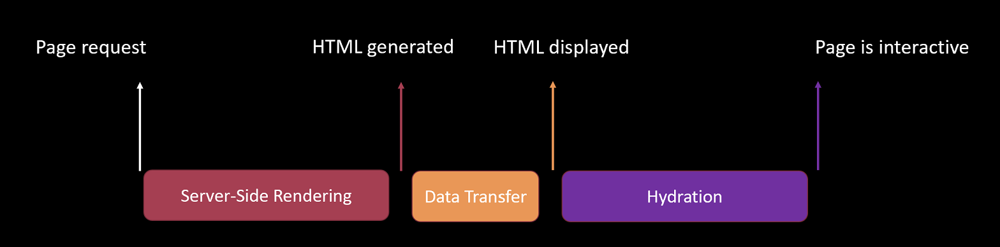
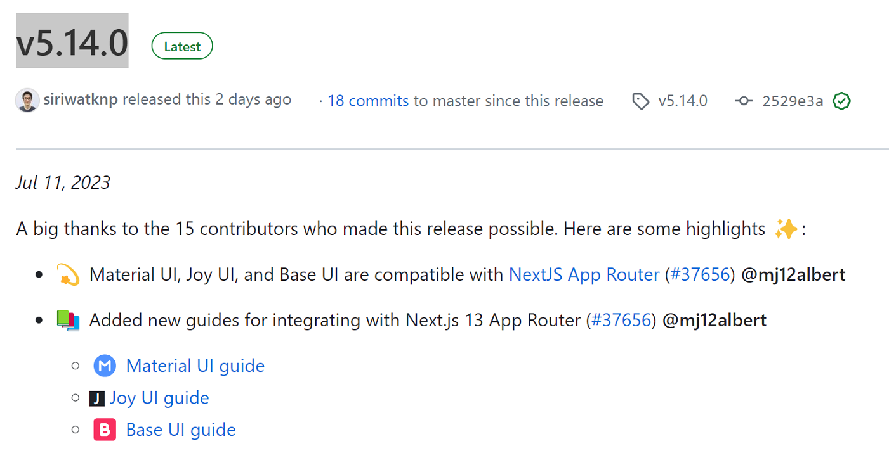

# NextJs and new Server Somponents - How to use and limitations

Hello everyone, recently I have spent a lot of time dealing with the new feature in [Next.JS](https://nextjs.org/) - server components, and now I want to share my experience and some thoughts about this update, including the benefits, limitations, and how to use them in real-life scenarios.

If you are interested in Next.JS or web performance in general, grab a cup of coffee and let's start reading!

## Why were server components introduced?

Let's start with the most important question - **"Why were server components introduced?"**

As you probably already know, Next.JS works as follows (simplified):

- The client requests the address served by the Next.JS server.
- Next.JS, at runtime (optimizations with caching may occur), receives the necessary data to create the page.
- Then, it creates an HTML page that is sent to the client, along with the javascript code. Since the page is just plain HTML, the user sees it as it loads and, unlike SPA, doesn't have to wait for React to create it from scratch on the client-side.
- After receiving the client bundle, the hydration process takes place - transforming static HTML into the familiar React application that the user can interact with. If hydration is not performed, the user won't be able to interact with the HTML page because all event listeners are added at this stage

Schematically this looks something like this:

The reason for all this non-trivial process is to ensure that your users see the content they need as quickly as possible and doesn't leave your website frustrated. It also simplifies the life of SEO robots and increases the chances of your page ranking higher in search results. Meanwhile, the developer can work in the familiar and convenient React with all its advantages - a component approach, HMR, and a rich toolkit.

Unfortunately this process has drawbacks, the biggest of which is that it takes time to hydrate, during which the application is non-interactive. The larger your bundle, the more time it takes to hydrate. There is even a possibility that the user has already loaded the page, tries to interact with it, but it doesn't respond because the main thread is busy. This leaves the impression that the page doesn't work at all, and people may just leave and tell their friends that your store doesn't work.

The second drawback is that, as in hydration and the React application lifecycle, all components participate, even those whose content never changes. This, accordingly, reduces the response time of your page to user actions, which is bad for the user experience.

And here come the server components to the rescue, which try to solve both problems at once by:

- **Dependencies used in server components are not included in the bundle at all**. This reduces its size and speeds up the moment when your page becomes interactive.

- **Server components do not participate in either hydration or the application lifecycle**, which speeds up the application's response time (giving more time for other operations) and saves your phone's battery.

Of course, such magic is not free, so server components have significant limitations (some of which almost completely negate their usefulness, at least for now).

## Rules and limitations of server components

**The first rule of server components** is that server components cannot have added behavior such as useState, useEffect, onClick, and other interactive features. This is logical since server components cannot be changed on the client-side. If you still need some behavior, you need client components. Regular functions, including fetch, are allowed. But keep in mind that server components run on the server, so they cannot access the browser API, window, and document objects. Another interesting point is that native interactivity of elements has not disappeared, so forms, checkboxes, radio buttons, links, summary, and all other components with built-in behavior will work fine.

Also, server components cannot use context, which means that many familiar tools built on context - such as Redux Toolkit, Emotion, and even the popular MUI component library - do not work with server components. And this, in my opinion, is the biggest and most significant drawback of server components, which almost negates all their benefits. However, there is an experimental server context, but it is not yet used by third-party libraries and does not work correctly during navigation.

**The second rule of server components** is that all components are considered server components until otherwise stated. If you need a client component, you must add the 'use client' directive at the beginning of the file with the components, before all imports.

**The third rule of server components** is that importing a server component to the client automatically transforms it into a client component, thereby depriving it of all the advantages I mentioned above. This moment is very important, so I emphasize it again: any server components imported into a client component are automatically converted into client components. This effect is transitive - sub-components also become client components automatically, and so on until the last component in the hierarchy.

The practical consequence of this is that if you add the `"use-client"` directive to your root component (such as a page), all its imports and the imports of their imports will automatically be converted to client components, which will still be rendered on the server-side but lose the benefits of server components, such as reduced bundle size and avoiding re-rendering; therefore, the `"use-client"` directive should be used as low in the import hierarchy as possible, or alternatively, you can use children in client components, as long as the composing component is a server component because there is no direct import.

**Finally, the fourth rule of server components** is that they can be asynchronous and can receive data directly in the component body, without any useEffect. Then, this data can be processed and passed to the client components, which can create context and add some interaction. And for handling errors that occur during asynchronous operations, you can add an error.jsx/tsx file. This is quite convenient and slightly improves the impression of all previous limitations, but not much.

## Wrapping up

In summary, the technology of server components has the potential to make your applications faster by reducing the bundle size. However, the inability to use context and libraries built on it almost completely negates their usefulness in the real world. Even if your page is completely static but uses a popular CSS in JS library like Emotion for styling, you cannot fully utilize server components - at best, you can use them as a container for convenient data retrieval, but obviously, this is not what developers had in mind when they added server components.

Thanks for the attention!

## UPDATE

[Material UI](https://github.com/mui/material-ui/releases/tag/v5.14.0) version 5.14.0 has announced support for the new app router in Next.js and updated their guides:

Hopefully, we will see some progress with other tools soon
