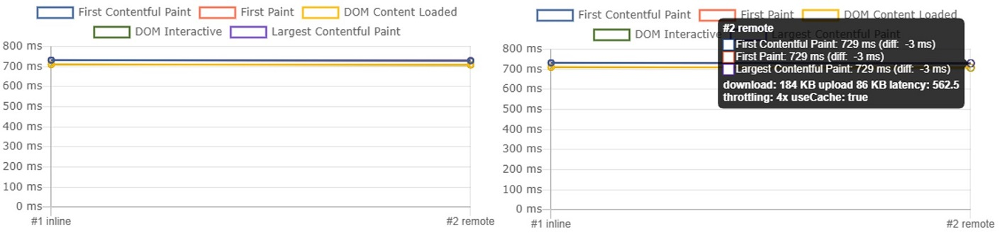
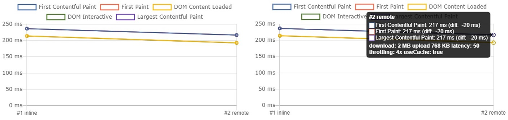
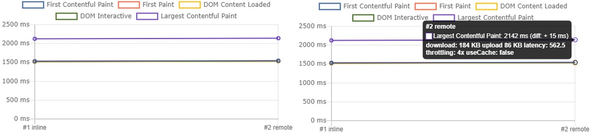
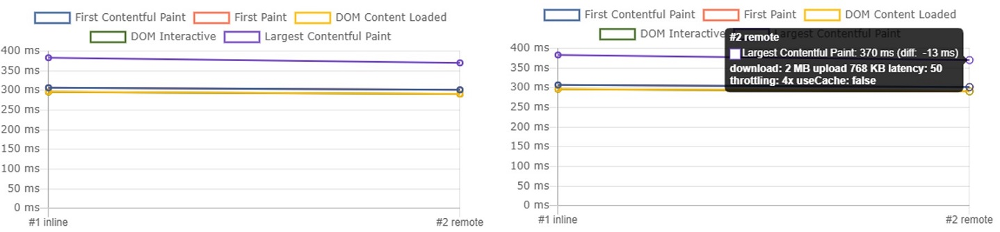

# How to user React without unsafe-inline and why.

React.JS is an awesome library that widely used all over the world. However, it also contains some pitfalls that might negatively impact your application. And here I want to discuss one of such pitfalls - inlined runtime chunk that might affect your application security.

If you ever opened the built index.html, you probably already saw something like this:

```html
...
<!--index.html-->
<div id="root"></div>
<script>!function (e) { function r(r) { for (var n, l, f = r[0], i = r[1], a = r[2], c = 0, s = []; c < f.length; c++)l = f[c], Object.prototype.hasOwnProperty.call(o, l) && o[l] && s.push(o[l][0]), o[l] = 0;}</script>
<script src="/static/js/2.1478fb8e.chunk.js"></script>
...
```

What is this first piece of code? It is a small chunk of webpack runtime logic which is used to load and run your application. And if you remove or alter it, your application will be broken. Then, what is the issue?

Itself, this code is safe (at least for now), already optimized and minified. But the way it is embedded might brings you some troubles, related to security. For those, who already use [Content-Security-Policy header](https://developer.mozilla.org/en-US/docs/Web/HTTP/CSP), the problem should be obvious, but if you are not familiar with this technique, I will explain a bit more.

A long time ago when [netscape](https://en.wikipedia.org/wiki/Netscape_Navigator) was young, we don't have any mechanism to define trusted sources for the web site's resources. If the browser saw the script tag, it evaluated it and executed it. If the browser saw a scrip with src, it loaded it and executed it. If the browser saw an image ... you understand, it loaded image and render it. Despite (or because) the simplicity, this behavior opens door to some serious troubles - like [XSS](https://developer.mozilla.org/en-US/docs/Glossary/Cross-site_scripting).

However, times changed. Nowadays we can control what sources are trusted and what resources can be used by the browser. This is done by the HTTP Header named Content-Security-Policy. This header defines sources that are trusted and might be used by the browser.

```
Content-Security-Policy: default-src 'self';
```

In this example, the server, using Content-Security-Policy header, dictates to the browser to use resources only from the same domain index.html was loaded from. If an attacker will find XSS vulnerability and embed some script inside the page, the browser will refuse to load it, because loading scripts from other domains already forbidden. And if attacked embed plain javascript on the page, it will also not work. Because inline resources required special permission - unsafe-inline.

This header is so cool, that it can also deny executing inlined scripts and even [eval](https://developer.mozilla.org/en-US/docs/Web/JavaScript/Reference/Global_Objects/eval)
Even more, if attackers embed plain javascript in the page, it will also not work. Because inline resources required special permission - unsafe-inline.

```
Content-Security-Policy: default-src 'self'; script-src 'unsafe-inline';
```

Here you can find more about Content-Security-Policy and some other useful security headers - [drag13.io/posts/security-headers].

Probably, you already see the issue. If you decide to protect your site with CSP-Header (and I highly recommend doing this), you will have to allow unsafe-inline code, because, in another case, React will just not work. Which in turn, leaves the door open to other, potentially malicious, inlinings.

What you can do?

* Use nonce attribute.

* Opt-out from using unsafe runtime script inlining.

The good news is that this option is already supported with INLINE_RUNTIME_CHUNK variable and it is quite easy to set up it. To use react without unsafe inline code, you need set INLINE_RUNTIME_CHUNK to false, like here:

```json
/*package.json*/
"build": "(SET INLINE_RUNTIME_CHUNK=false) && react-scripts build",
```

Or just use add INLINE_RUNTIME_CHUNK=false to the .env file

And this is it! Now you can use React.JS application with CSP header without unsafe-inline (of course if you don't have other inlined code).

But what about performance? If we moved it out of the index.html, doesn't it slow the application loading? I was also wondering about this. So, I created a simple web application (B1 if you are wondering) in Azure, created default React application, and did a couple of tests with [perfrunner](https://www.npmjs.com/package/perfrunner). And here is what I've found

## 3G, cache enabled

For the slow connections like 3G, if the visit is not the first one (resources are cached), no difference appears. [First-Contentful-Paint] and [Largest-Contentful-Paint] events are allmost equals for inlined and not inlined scenarious.



## 4G, cache enabled

For better connection, when resoruces already cached, scenario with opted-out inlining is slightly better. Difference is about 20ms for both events. So I would consider them equals.

Charts for better clarity:


However, the tests was done when resources are already cached. When user visits site first time, resources not cached and situation might be differet. Let's do some more tests!

## 3G, disabled - first visit

For slow network we see that very small difference. With inlined runtime chunk Largest-Contentful-Paint event appears at 2127. For the fetched runtime chunk, it appears slighty later - 2142 wich means 15ms later. So I would say they also more less equals



## 4G, disabled - first visit

For faster netwrok, like 4G, tests with fetched runtime chunks shows even better performance: 383ms vs 370ms. But, the difference is so small that we may treat them as equal.



So, from performance perspective, using fetched runtime chunk also seems safe.

## Summary

Making React applications compliant with Content-Security-Policy is easy and will help you imporove security of your project.


